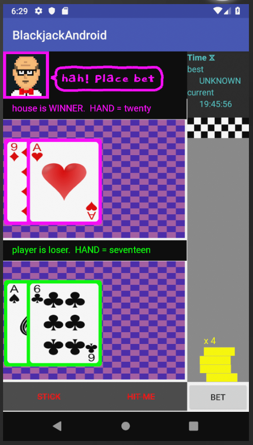

# blackjack vs the world
### roadmap
* responsive: compatible with s/m/h/xh/xxh/xxxh dpi screen sizes on handsets [supporting different pixel densities](https://developer.android.com/training/multiscreen/screendensities)
* localization for china/japan and other countries
* backend server/database to store online leaderboard data
* completely detach any model logic and controller logic code in MVC architecture completely away from any android framework code/api's in view, so can test in isolation
* optimise code, run calls to controller/model on a background thread and run UI updates/draws back onto an android handler thread.
* decent unit testing coverage for model and controller code

